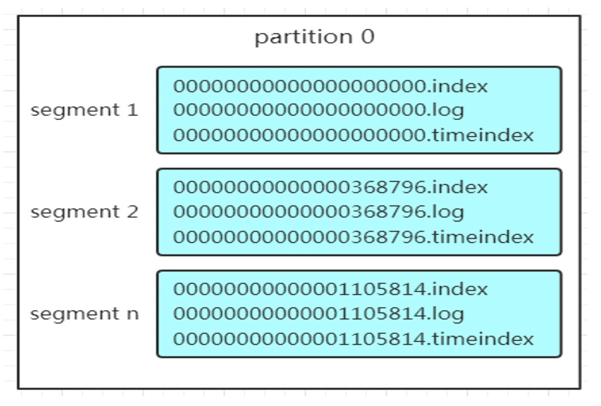
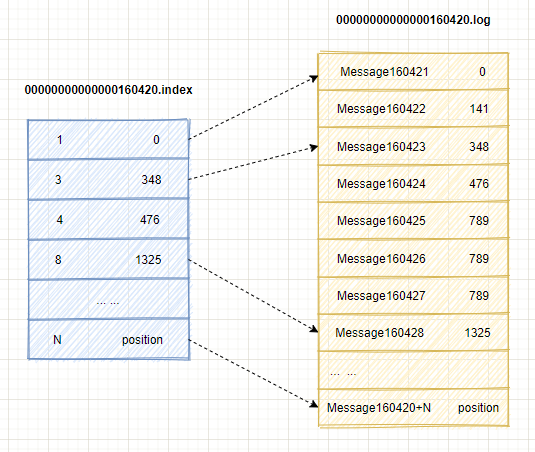

# Kafka笔记

工作中有大量的kafka使用场景，学习记录一下kafka的架构和原理

#### 为什么要引入消息队列

- 各个组件间的解藕
- 流程之间的异步处理
- 流量控制

#### 核心概念

- **Broker**：broker指的就是一个kafka服务器
- **Producer**：消息生产者，就是向broker发送消息的客户端
- **Consumer**：消息消费者，向kafka borker拉取消息的客户端
- **Consumer group**：消费者组，由多个消费者组成，不同组通过group id进行区分，一条消息只能被一个组里面的某个消费者消费，但是不同组之间可以同时消费一条消息，换句话来说**消费者组是逻辑上的一个订阅者**
- **topic**：主题队列，可以理解为一个存放特定消息的队列
- **partition**：一个topic可以分布在不同的broker上，用不同partition表示，这是为了方便拓展和提高并发
  - 拓展：一个topic可以有多个partition，所以可以通过拓展partition也就是拓展机器来应付增长的数量
  - 提高并发：不是以topic为读写单位，而是已partition为读写单位，可以多个消费者组并发消费数据，提高消息的处理效率

#### Kafka消息存储

##### 分区(partition)

对于一个topic，可以将数据分散存储在多个服务器上，每一部分称为一个``分区(partition)``，通过参数`num.partition` 来进行控制，默认为1，

##### 分区结构

分区设计：分段+索引的结构设计，一个分区由多个段组成

- Segment：文件段
- .log：日志文体，在kafka中把数据文件就叫做日志文件，
- .index/.：位移索引
- .timeindex：时间戳索引

partition 全局的第一个 segment 从 0 开始，后续每个 segment 文件名为上一个segment 文件最后一条消息的 `offset` 值。
数值大小为 64 位，20 位数字字符长度，没有数字用 0 填充

kafka在写入日志文件时，同时会维护索引文件，在往日志文件中写入了一定量的数据后，就会往索引文件中写入一条索引，所以索引本身是**稀疏**格式的索引，索引文件里的数据是按照位移和时间戳升序排序的，所以kafka在查找索引的时候，会用**二分查找**，时间复杂度是O(logN)，找到索引，就可以在.log文件里定位到数据了，如下图所示，[1, 3, 4, 8...]表示消息在segment的index, [0, 348, 476...]表示数据在磁盘中的物理偏移地址。

索引文件中 [3, 348] , 3 在 .log 文件中表示第 3 个消息，那么在全局 partition 表中表示为 160420 + 3 = 160423。

> 参数 log.index.interval.bytes 控制写入多少量的日志后添加索引，默认值为4KB

#### Kafka生产者

生产者发送消息流程

##### 分区的计算

生产者需要把消息发送到Topic的某个partition中，那到底发送到哪个分区中呢，这个是和消息的`key`有关的，

- 当没有给消息设置key时，消息会以`轮询`的形式发送到下一个分区中

- 也可以给消息指定一个key，会根据`key+topic`计算出hash值，然后对分区数取余，这样可以保证同样的key肯定会发送到同一个分区上

  > 可以利用这一点，来控制某些消息往固定的分区发送

##### 分区器partitionor

知道了要发往哪个分区，一般情况下，kafka都是以集群的形式部署的，而写入操作是会写到leader节点上的，那怎么知道哪个broker上的分区是这个分区的leader呢，使用的是partitionor分区器，来获取kafka集群的元数据，从而知道哪个是leader partition

##### 缓冲区

kafka并不会立即将消息发送出去，而是包装成RecordBatch，批量收集，放入缓冲区中

##### Sender线程

如果batch满了，就会唤醒sender线程，将这个batch发送到对应的broker上

##### Kafka消费者

###### offset

每个消费者都在内存中保存着对topic分区的消费offset，定期会提交offset，会往`__consumer_offsets`这个kafka内部topic提交，key为`group.id+topic+分区号`， value为对应的offset

每隔一段时间，kafka会对相同key对offset进行合并，只保留最大的那个offset

> Kafka 0.8版本之前offset是保存在zk上的，之后才是保存在本地内存中

###### 从哪开始消费

offset就是用来控制当消费者应该从分区中的哪里进行消费的，如果当前分区没有该`group.id`的offset时，同时受另一个参数`auto.offset.reset`的影响

- earliest：无提交的offset时，从头开始消费
- latest：无提交的offset时，消费新产生的数据

##### Consumer group的负载均衡

