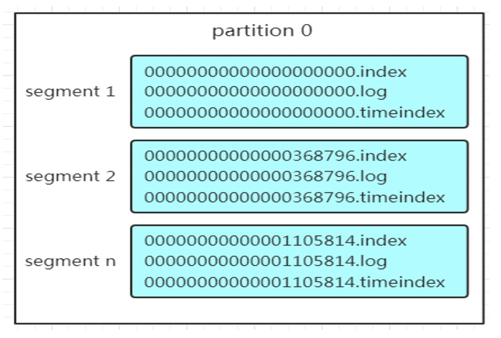
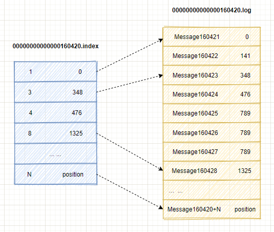
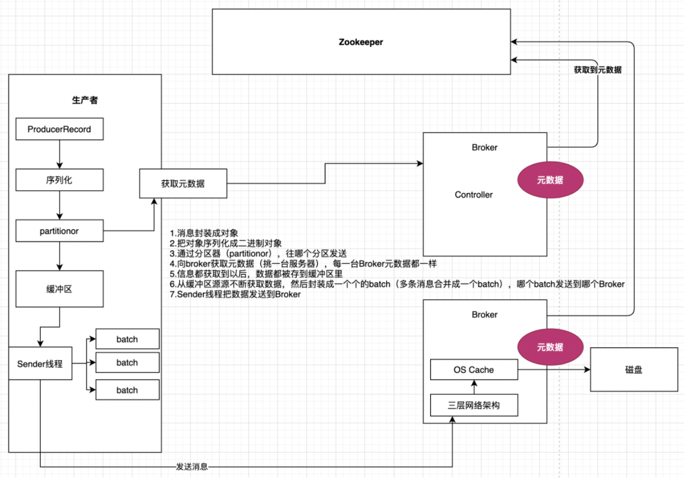
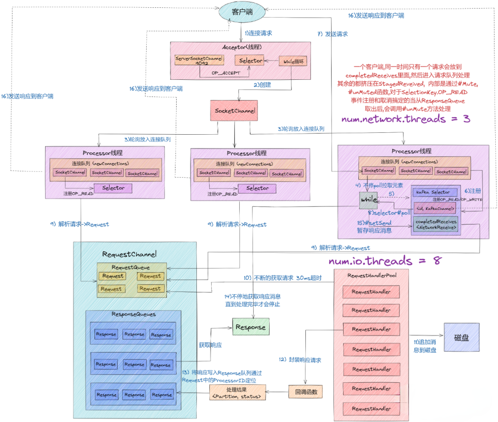
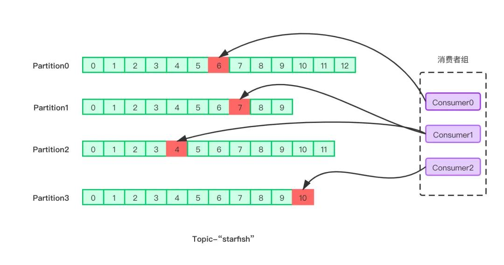
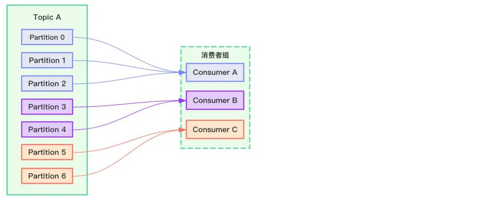
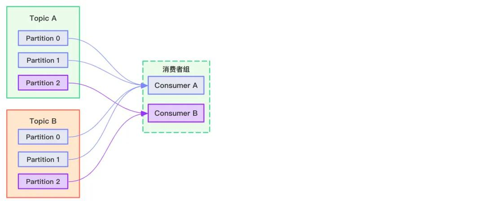
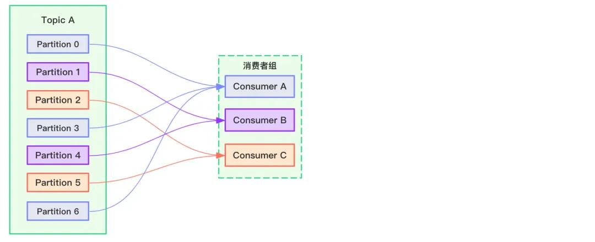

# Kafka笔记

工作中有大量的kafka使用场景，学习记录一下kafka的架构和原理

#### 为什么要引入消息队列

- 各个组件间的解藕
- 流程之间的异步处理
- 流量控制

#### 核心概念

- **Broker**：broker指的就是一个kafka服务器
- **Producer**：消息生产者，就是向broker发送消息的客户端
- **Consumer**：消息消费者，向kafka borker拉取消息的客户端
- **Consumer group**：消费者组，由多个消费者组成，不同组通过group id进行区分，一条消息只能被一个组里面的某个消费者消费，但是不同组之间可以同时消费一条消息，换句话来说**消费者组是逻辑上的一个订阅者**
- **topic**：主题队列，可以理解为一个存放特定消息的队列
- **partition**：一个topic可以分布在不同的broker上，用不同partition表示，这是为了方便拓展和提高并发
  - 拓展：一个topic可以有多个partition，所以可以通过拓展partition也就是拓展机器来应付增长的数量
  - 提高并发：不是以topic为读写单位，而是已partition为读写单位，可以多个消费者组并发消费数据，提高消息的处理效率

#### Kafka消息存储

##### 分区(partition)

对于一个topic，可以将数据分散存储在多个服务器上，每一部分称为一个``分区(partition)``，通过参数`num.partition` 来进行控制，默认为1，

##### 分区结构

分区设计：分段+索引的结构设计，一个分区由多个段组成

- Segment：文件段
- .log：日志文体，在kafka中把数据文件就叫做日志文件，
- .index/.：位移索引
- .timeindex：时间戳索引

partition 全局的第一个 segment 从 0 开始，后续每个 segment 文件名为上一个segment 文件最后一条消息的 `offset` 值。
数值大小为 64 位，20 位数字字符长度，没有数字用 0 填充

kafka在写入日志文件时，同时会维护索引文件，在往日志文件中写入了一定量的数据后，就会往索引文件中写入一条索引，所以索引本身是**稀疏**格式的索引，索引文件里的数据是按照位移和时间戳升序排序的，所以kafka在查找索引的时候，会用**二分查找**，时间复杂度是O(logN)，找到索引，就可以在.log文件里定位到数据了，如下图所示，[1, 3, 4, 8...]表示消息在segment的index, [0, 348, 476...]表示数据在磁盘中的物理偏移地址。

索引文件中 [3, 348] , 3 在 .log 文件中表示第 3 个消息，那么在全局 partition 表中表示为 160420 + 3 = 160423。

> 参数 log.index.interval.bytes 控制写入多少量的日志后添加索引，默认值为4KB

#### Kafka生产者

生产者发送消息流程

##### 分区器partitionor

假设知道了要发往哪个分区，一般情况下，kafka都是以集群的形式部署的，而写入操作是会写到leader节点上的，那怎么知道哪个broker上的分区是这个分区的leader呢，使用的是partitionor分区器，来获取kafka集群的元数据，从而知道哪个是leader partition

##### 分区的计算

生产者需要把一个batch的消息发送到Topic的某个partition中，那到底发送到哪个分区中呢，这个是和消息的`key`和分区器有关的，

- **默认分区器(DefaultPartitioner)**
  - 当没有给消息设置key时，消息会以`带有粘性的随机`的形式发送到下一个分区中
  - 也可以给消息指定一个key，会根据`key`计算出hash值，然后对分区数取余，这样可以保证同样的key肯定会发送到同一个分区上
- **轮询分区器(RoundRobinPartitioner)**：字面意思，以轮询的形式，获取该topic的下一个分区进行发送
- **根据业务自定义自己的分区器**：实现接口`Partitioner`，并在初始化生产者时，把自己的实现类放进参数map中的`partitioner.class`即可

##### **缓冲**区

kafka并不会立即将消息发送出去，而是包装成RecordBatch，放入缓冲区`BufferPool`中

> 缓存区的模型和内存和其他细节，打算放在kafka源码阅读笔记中

##### Sender发送时机

先了解两个参数

- `linger.ms`：发送延迟时间，默认0
- `batch.size`：每个RecordBatch的最大容量，默认：16384，16K

为减少负载和客户端的请求数量，生产者不会一条一条发送，而是会逗留一段时间批量发送。batch.size和linger.ms满足任何一个条件都会发送

##### 生产者投递消息的可靠性

为了能保证kafka生产者能够尽最大可能的不丢失发送的数据，kafka加入了ack确认机制，这涉及到两个重要的参数

- **acks**：acks确认机制
  - value=0，表示生产者在消息写入之前不会等待来自服务器的任何应答，一旦消息发送失败，生产者无法感知到
  - **value=1（默认）**，表示生产者只要接收到partition leader的ack确认，就认为消息写入成功了，如果写入失败，会收到错误的响应，会重新发送消息
  - value=all，表示生产者只有自接收到partition leader和partition的ISR列表所有的从节点

#### 高并发网络架构

kafka能支持超大并发的请求，有很大的功劳来自于kakfa基于`Reactor` 事件处理设计模式的超高并发网络架构

##### Acceptor 线程

在Reactor网络设计模式中，会有一个`Dispatcher`模块用来接收各种请求并请求分发给对应的handler，而Acceptor线程就起到Dispatcher的作用。

在kafka broker中只会创建一个Acceptor线程用来创建连接，并将接收到的请求放到到Processor线程中去进行处理，所以Acceptor线程做的工作非常轻量

##### Process 线程

真正创建网络连接以及分发网络请求是由 Processor 线程来完成的，每个Process线程在创建时都会创建三个队列

- **newConnections 队列**: 它主要是用来保存要创建的新连接信息，也就是SocketChannel 对象，队列长度大小为20。每当 Processor 线程接收到新的连接请求时，都会将对应的 SocketChannel 对象放入队列，等到后面创建连接时，从该队列中获取 SocketChannel，然后注册新的连接。
- **ResponseQueue 队列：**它主要是存放需要返回给Request 发送方的所有 Response 对象。每个 Processor 线程都会维护自己的 Response 队列
- **inflightResponse 队列**：它是一个临时的 Response 队列， 当 Processor 线程将 Repsonse 返回给 Client 之后，要将 Response 放入该队列。它存在的意义：由于有些 Response callback要在 Response 被发送回 Request 发送方后，才能执行，因此需要暂存到临时队列

##### KafkaRequestHandler 线程

而具体的读写IO请求是由`KafkaRequestHandler`来进行处理的，默认会有8个KafkaRequestHandler被维护在 RequestHandlerPool中，通过参数`num.io.threads`来控制

##### 请求处理流程

- 客户端、其他broker请求连接都会被Acceptor线程接管
  - Acceptor线程在首次初始化时，会创建出Java NIO Selector、ServerSocketChannel，并将ServerSocketChannel的OP_ACCPECT事件注册到Selector上，并创建默认3个processor线程，可以由`num.network.threads`控制
  - Acceptor会不断的将连接请求SocketChannel放入到 Processor线程中的newConnections队列中
- Processor 线程源源不断的从newConnections队列中poll SocketChannel，并将其OP_WRITE/OP_READ事件注册到Selector中
- 这样客户端就可以源源不断的发送请求了，而processor线程就不断通过Selector获取到就绪的IO事件，构建 Request 对象并放入Requestchannel中的 RequestQueue中
- KafkaRequestHandler 线程会不断的从`RequestQueue 队列`中获取请求，然后处理逻辑，比如读写消息，处理完成后，将结果包装成 Response ，放入ResponseQueue 中
- 最后 Processor 线程通过 Request 中的 ProcessorID 不停地从 Response 队列中来定位并取出 Response 对象，返回结果

#### Kafka消费者

##### offset

每个消费者都在内存中保存着对topic分区的消费offset，定期会提交offset，会往`__consumer_offsets`这个kafka内部topic提交，key为`group.id+topic+分区号`， value为对应的offset

每隔一段时间，kafka会对相同key对offset进行合并，只保留最大的那个offset

> Kafka 0.8版本之前offset是保存在zk上的，之后才是保存在本地内存中

##### 从哪开始消费

offset就是用来控制当消费者应该从分区中的哪里进行消费的，如果当前分区没有该`group.id`的offset时，同时受另一个参数`auto.offset.reset`的影响

- earliest：无提交的offset时，从头开始消费
- latest：无提交的offset时，消费新产生的数据
- none：没有提交的offset时，抛出异常

##### 消费者组

消费者是以 consumer group 消费者组的方式工作，由一个或者多个消费者组成一个组， 共同消费一个 topic。每个分区在同一时间只能由 group 中的一个消费者读取，但是多个 group 可以同时消费这个 partition。

##### Coordinator 

一个消费者组中哪个消费者消费哪个消费哪几个partition，也就是分区分配策略，以及如果某些消费者挂了应该怎么重新分配其消费的分区等待问题，需要有统一的管理，而这由Coordinator来实现

每个consumer group都会选择一个broker作为自己的coordinator，他是负责监控这个消费组里的各个消费者的心跳，以及判断是否宕机，然后开启rebalance的

###### 如何选择Coordinator

首先对groupId进行hash，接着对`_consumer_offsets`的分区数量取模，默认是50，_consumer_offsets的分区数可以通过`offsets.topic.num.partitions`来设置，找到分区以后，这个分区所在的broker机器就是coordinator机器

##### 消费方案的确定流程

- 每个consumer都发送` join-group`请求到Coordinator
- 然后Coordinator从consumer group中选择**第一个成功加入Group的consumer**作为leader
- **具体的消费策略是由leader consumer来制定的**，所以Coordinator把consumer group情况发送给这个leader
- Coordinator会给所有发送join-group的consumer发送response，consumer收到Coordinator的response后，如果是leader，就会将具体的消费策略发送给Coordinator，而其他follower则发送一个空列表
- 接着Coordinator就把消费方案下发给各个consumer，他们会从指定的分区的 leader broker 开始进行socket连接以及消费消息

##### 分区分配策略

- **Range**：按照范围依次给各个消费者均匀的分配消费分区

  

  缺点：同一个组内的消费者消费的分区可能差距很大，如下图所示

  

  并且当consumerA挂了，partition0~3会分配给consumerB，4～6会分配给consumerC，这导致了B

- **round-robin轮询分配**：按顺序一个一个的分配给消费者，直到分配完成

  

  > range和轮询都有一个缺点，就是在某个消费者挂了之后，重新分配消费分区可能会导致原本自己消费的分区被分给了其他消费者，相当于丢失了分区，比如当consumerA挂了，对于range来说，partition0~3会分配给consumerB，4～6会分配给consumerC，这导致了B丢失了原本消费的partition4，同理，对于round-robin来说B丢失了分区1，C丢失了分区2

- **sticky**：sticky策略在rebalance的时候，会在保持原有消费的分区的情况下，再把多余的分区均匀的分配给剩下的消费者