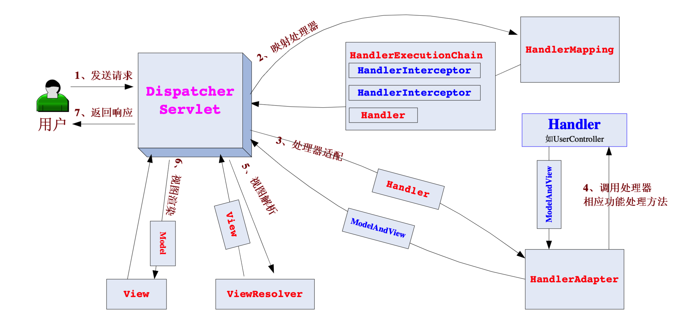

# Spring笔记

#### Spring核心要点

- **控制反转IOC**：使用Spring之前，对象的使用和创建是绑定在一起的，除了主要的逻辑代码外，还需要为依赖的其他对象做很多复杂的创建工作，**引入了Spring之后，就可以将创建和使用分离开**，把对象的创建工作交由Spring框架来进行处理，需要用到的时候从Spring的容器中获取即可
- **面向切面AOP**：不同业务模块的解耦

#### 控制反转IOC

##### 配置方式

- XML、JavaConfig
- 注解配置：@Component、@Controller、@Service、@Repository

##### 依赖注入的方式

- 构造方法注入（Construct注入），
- setter注入
- 基于注解的注入（接口注入）
  - @Autowired：根据Type类型，c出现多个就根据name来匹配

#### Spring MVC

一个基于MVC模式设计的轻量级web 框架

##### Spring MVC请求流程

- **首先用户发送请求——>DispatcherServlet**，前端控制器收到请求后自己不进行处理，而是委托给其他的解析器进行 处理，作为统一访问点，进行全局的流程控制；
- **DispatcherServlet——>HandlerMapping**， HandlerMapping 将会把请求映射为 HandlerExecutionChain 对象（包含一 个Handler 处理器（页面控制器）对象、多个HandlerInterceptor 拦截器）对象，通过这种策略模式，很容易添加新的映射策略；目的：获得请求映射到的handler处理器以及拦截器
- **DispatcherServlet——>HandlerAdapter**，HandlerAdapter 将会把处理器包装为适配器，从而支持多种类型的处理器， 即适配器设计模式的应用，从而很容易支持很多类型的处理器；
- **HandlerAdapter——>处理器功能处理方法的调用**，HandlerAdapter 将会根据适配的结果调用真正的处理器的功能处 理方法，完成功能处理；并返回一个ModelAndView 对象（包含模型数据、逻辑视图名）；
- **ModelAndView 的逻辑视图名——> ViewResolver**，ViewResolver 将把逻辑视图名解析为具体的View，通过这种策 略模式，很容易更换其他视图技术；
- **View——>渲染**，View 会根据传进来的Model 模型数据进行渲染，此处的Model 实际是一个Map 数据结构，因此 很容易支持其他视图技术；
- **返回控制权给DispatcherServlet**，由DispatcherServlet 返回响应给用户，到此一个流程结束。

