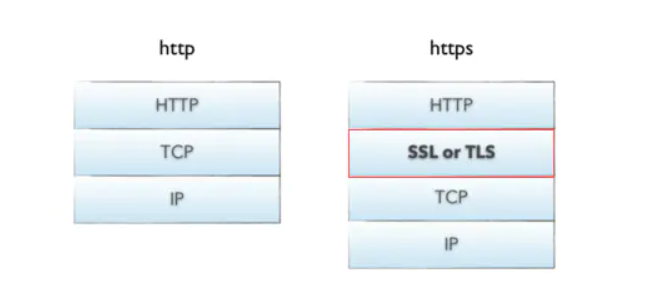
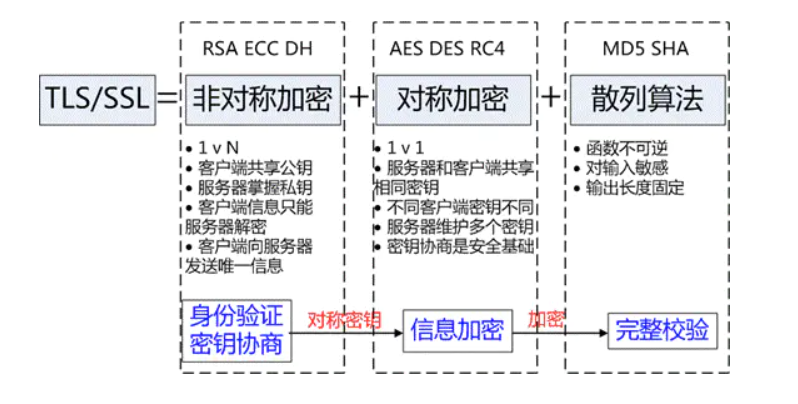
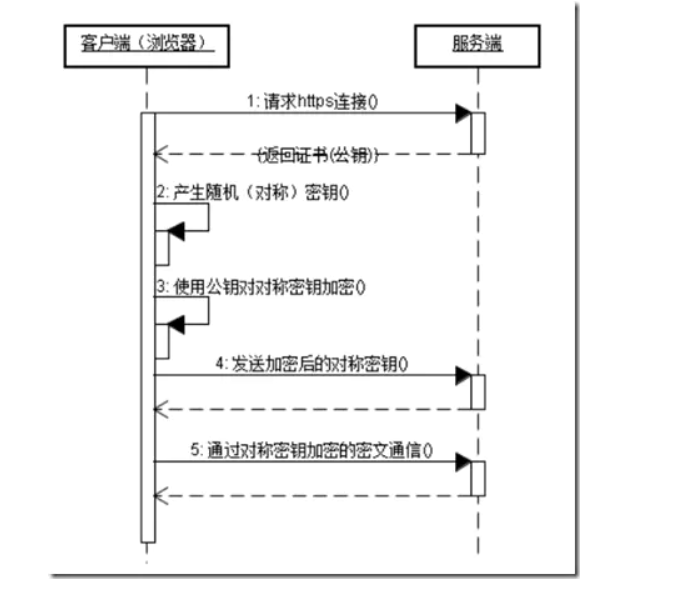
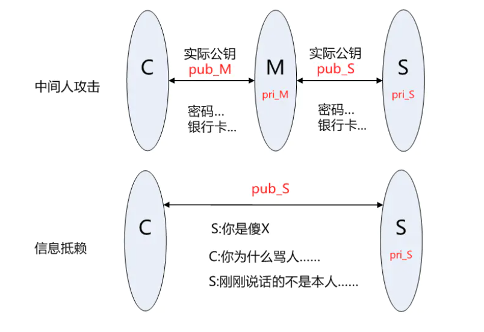
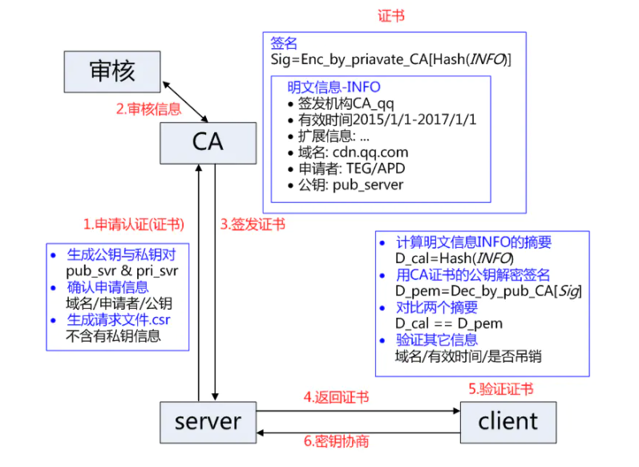
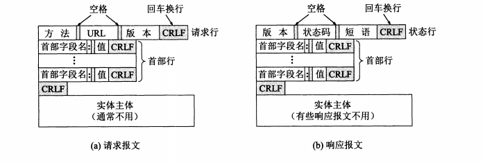
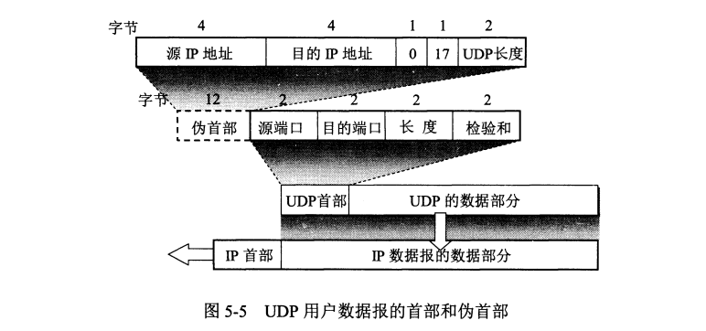
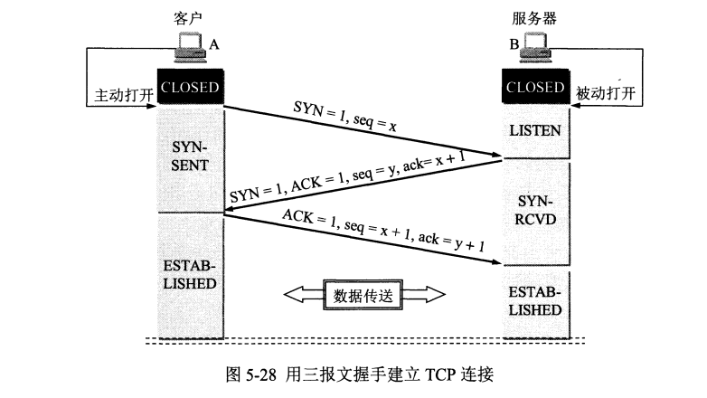
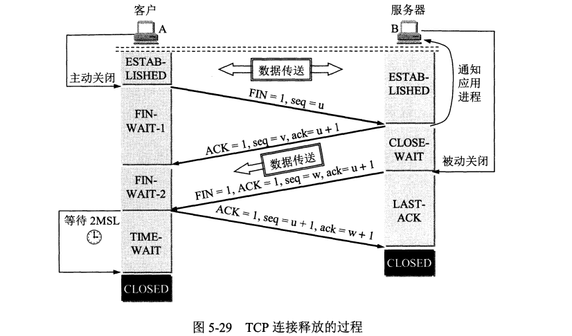

# 计算机网络

#### Http和Https的区别？

- 其实HTTPS就是从HTTP加上加密处理（一般是SSL安全通信线路）+认证+完整性保护
- 区别：
  1. https需要拿到ca证书，需要钱的
  2. 端口不一样，http是80，https443
  3. http是超文本传输协议，信息是明文传输，https则是具有安全性的ssl加密传输协议。
  4. http和https使用的是完全不同的连接方式（http的连接很简单，是无状态的；HTTPS 协议是由SSL+HTTP协议构建的可进行加密传输、身份认证的网络协议，比http协议安全。）

> HTTPS也就是在TCP协议和HTTP协议之间加上了一层TLS/SSL协议

#### TLS/SSL工作原理

TLS/SSL的功能实现主要依赖于三类基本算法：非对称加密和对称加密、散列函数 Hash

其利用非对称加密实现身份认证和密钥协商，对称加密算法采用协商的密钥对数据加密，基于散列函数验证信息的完整性

##### RSA身份验证的隐患

身份验证和密钥协商是TLS的基础功能，要求的前提是合法的服务器掌握着对应的私钥。但RSA算法无法确保服务器身份的合法性，因为公钥并不包含服务器的信息，存在安全隐患:

- 客户端C和服务器S进行通信，中间节点M截获了二者的通信;
- 节点M自己计算产生一对公钥pub_M和私钥pri_M;
- C向S请求公钥时，M把自己的公钥pub_M发给了C;
- C使用公钥 pub_M加密的数据能够被M解密，因为M掌握对应的私钥pri_M，而 C无法根据公钥信息判断服务器的身份，从而 C和 * M之间建立了"可信"加密连接;
- 中间节点 M和服务器S之间再建立合法的连接，因此 C和 S之间通信被M完全掌握，M可以进行信息的窃听、篡改等操作。
- 另外，服务器也可以对自己的发出的信息进行否认，不承认相关信息是自己发出。

因此这个方案至少存在两个问题：**中间人攻击和信息抵赖**

##### 身份验证CA和证书

解决上述身份验证问题的关键是确保获取的公钥途径是合法的，能够验证服务器的身份信息，为此需要引入权威的第三方机构CA(如沃通CA)。CA 负责核实公钥的拥有者的信息，并颁发认证"证书"，同时能够为使用者提供证书验证服务，即PKI体系(PKI基础知识)。

基本的原理为，CA负责审核信息，然后对关键信息利用私钥进行"签名"，公开对应的公钥，客户端可以利用公钥验证签名。CA也可以吊销已经签发的证书，基本的方式包括两类 CRL 文件和 OCSP。CA使用具体的流程如下：

- 服务方S向第三方机构CA提交公钥、组织信息、个人信息(域名)等信息并申请认证;
- CA通过线上、线下等多种手段验证申请者提供信息的真实性，如组织是否存在、企业是否合法，是否拥有域名的所有权等;
- 如信息审核通过，CA会向申请者签发认证文件-证书。 证书包含以下信息：**申请者公钥、申请者的组织信息和个人信息、签发机构 CA的信息、有效时间、证书序列号等信息**的明文，同时包含一个签名，**签名的产生算法：首先，使用散列函数计算公开的明文信息的信息摘要，然后，采用 CA的私钥对信息摘要进行加密，密文即签名**;
- 客户端 C 向服务器 S 发出请求时，S 返回证书文件;
- 客户端 C读取证书中的相关的明文信息，采用相同的散列函数计算得到信息摘要，然后，利用对应 CA的公钥解密签名数据，对比证书的信息摘要，如果一致，则可以确认证书的合法性，即公钥合法;
- 客户端然后验证证书相关的域名信息、有效时间等信息;
- 客户端会内置信任CA的证书信息(包含公钥)，如果CA不被信任，则找不到对应 CA的证书，证书也会被判定非法。
- 在这个过程注意几点：
- 申请证书不需要提供私钥，确保私钥永远只能服务器掌握;
- 证书的合法性仍然依赖于非对称加密算法，证书主要是增加了服务器信息以及签名;
- 内置 CA 对应的证书称为根证书，颁发者和使用者相同，自己为自己签名，即自签名证书（为什么说"部署自签SSL证书非常不安全"）
- **证书=公钥+申请者与颁发者信息+签名**

#### HTTPS接入优化

###### CDN接入

HTTPS 增加的延时主要是传输延时 RTT，RTT 的特点是节点越近延时越小，CDN 天然离用户最近，因此选择使用 CDN 作为 HTTPS 接入的入口，将能够极大减少接入延时。CDN 节点通过和业务服务器维持长连接、会话复用和链路质量优化等可控方法，极大减少 HTTPS 带来的延时。

###### 会话缓存

虽然前文提到 HTTPS 即使采用会话缓存也要至少1*RTT的延时，但是至少延时已经减少为原来的一半，明显的延时优化;同时，基于会话缓存建立的 HTTPS 连接不需要服务器使用RSA私钥解密获取 Pre-master 信息，可以省去CPU 的消耗。如果业务访问连接集中，缓存命中率高，则HTTPS的接入能力讲明显提升。当前TRP平台的缓存命中率高峰时期大于30%，10k/s的接入资源实际可以承载13k/的接入，收效非常可观。

###### 硬件加速

为接入服务器安装专用的SSL硬件加速卡，作用类似 GPU，释放 CPU，能够具有更高的 HTTPS 接入能力且不影响业务程序的。测试某硬件加速卡单卡可以提供35k的解密能力，相当于175核 CPU，至少相当于7台24核的服务器，考虑到接入服务器其它程序的开销，一张硬件卡可以实现接近10台服务器的接入能力。

###### 远程解密

本地接入消耗过多的 CPU 资源，浪费了网卡和硬盘等资源，考虑将最消耗 CPU 资源的RSA解密计算任务转移到其它服务器，如此则可以充分发挥服务器的接入能力，充分利用带宽与网卡资源。远程解密服务器可以选择 CPU 负载较低的机器充当，实现机器资源复用，也可以是专门优化的高计算性能的服务器。当前也是 CDN 用于大规模HTTPS接入的解决方案之一。

###### SPDY/HTTP2

前面的方法分别从减少传输延时和单机负载的方法提高 HTTPS 接入性能，但是方法都基于不改变 HTTP 协议的基础上提出的优化方法，SPDY/HTTP2 利用 TLS/SSL 带来的优势，通过修改协议的方法来提升 HTTPS 的性能，提高下载速度等。

#### 常用的加密算法

非对称加密：ECC(椭圆曲线加密算法)、DH加密算法

对称加密：AES加密算法、DES加密算法、RC4流加密算法

散列算法：MD5算法，SHA安全散列算法

# 七层模型详解

### 应用层

> 应用层的任务是解决不同主机之间的应用进程的通信的

##### 域名系统DNS

域名系统是用来将域名解析成IP地址的，域名将IP地址的解析过程如下：当某一个应用进程需要把主机名解析为IP地址时，就调用解析程序，成为DNS的一个客户，把待解析的域名放在DNS请求报文中，以**UDP**用户数据报的形式发送给本地DNS服务器

##### 文件传输协议FTP

> 控制连接端口号21，数据连接端口号20

FTP在运输层中选择的协议是TCP协议，**需要复制整个文件**，其特点是：如果要存取一个服务器上的文件，就需要获得这个文件的副本，如果要修改这个文件，则在本地上的副本上进行修改后，再传输给服务器。

如果不想这样，就要使用网络文件传输协议NFS，它允许应用进程打开一个远地文件，并在文件上进行读写，NFS在运输层采用的是UDP协议

FTP进行连接时，会在运输层创建两个并行的TCP连接，分别叫做**控制连接**和**数据连接**， 控制连接占用端口21，用来进行主机间的通信连接，而传输文件使用的是数据连接，占用的端口号是20

##### HTTP超文本传输协议

HTTP在运输层中采用的协议是TCP协议，虽然在HTTP通信之前需要在运输层进行TCP的连接，但是**HTTP本身是无连接的，也是无状态的**。

##### HTTP报文的结构

HTTP请求报文和响应报文的格式都是一样的，由三部分组成：

- 开始行，在请求报文当中称为请求行，在响应报文当中称为状态行
- 首部行，都是以首部字段和对应的值组成的
- 实体主体，请求报文中存放请求体，响应报文当中存放响应体

### 运输层

> 运输层的任务是为不同主机的通信提供数据传输服务
>
> 运输层采用一个16位端口号来标志一个端口，所以也就允许65535个不同的端口

运输层的两个主要协议

- 用户数据报协议UDP
- 传输控制协议TCP

##### UDP协议

- UDP是无连接的，尽最大可能交付，不保证可靠交付
- UDP面向报文的，UDP直接将数据报添加首部后就进行发送

##### UDP的首部格式

> UDP首部只含有8个字节，由四个字段组成，每个字段都是两个字节

- 源端口：需要对方回信时使用，不需要可全0
- 目的端口：终点交付报文的端口
- 长度，UDP用户数据报的长度，最小值是8（仅含有首部）
- 校验和，检测在传输过程中是否由错

##### TCP协议

TCP协议是面向字节流的，TCP把应用程序交下来的数据仅仅看成字节流

##### TCP报文的首部格式

TCP报文的首部最少为20个字节，有20个字节是固定的，后面4n字节是根据需要而添加上去的

- **源端口和目的端口**：各占2个字节，发送方的端口和目的地的端口

- **校验和**：和UDP一样，两个字节，校验的内容包括首部和数据两个部分，计算时需要添加伪首部

- **序号**：占用4个字节，范围是[0, 2^32 - 1]，序号增加到2^32之后，又会变回0，也就是说序列号是对2^32进行取模运算的，TCP数据报的每个字节都需要进行编号，**而序号就是这个数据报要发送的节点流的第一个序号**。

- **确认号**：占用4个字节，是期望收到对方下一个报文的序号

  > 总之：若确认号为N，则表明到目前为止序号为N - 1的数据报都已经被正常接收

- **数据偏移**：占用4位，指出TCP数据报数据部分距离数据报开始有多远，也相当于指明了首部占用了多少位

- **窗口**：占用2个字节，所以窗口值得范围为[0, 2^16 - 1]，表明接收方允许发送发最多能发送的字节数量

- 还有控制位，来表明报文段的性质

  - **确认ACK**，仅当ACK=1时确认号字段才有效，TCP规定，连接建立后所有传送的报文段都必须把ACK置1
  - **同步SYN**，在连接建立时用来同步序号，当SNY=1，ACK为0时代表这个报文为连接请求报文，而SYN=1和ACK为1代表整个报文为连接接受报文
  - **FIN终止**，当FIN=1时，表示此报文的发送方数据已经发送完毕，并要求释放连接

#### TCP可靠传输的实现

1.以字节为单位的滑动窗口

滑动窗口由窗口前沿和后沿的位置来共同决定，发送方根据接收方的窗口值，构造出自己的发送窗口，发送窗口由三个指针来确定，从左到右叫做p1,p2,p3。

1. 在p1之前的的字节序号表示已经发送并收到确认的字节
2. p1和p2之间代表已经发送的数据，但是没有收到确认的部分
3. 而p2和p3之间代表的是可用窗口，里面的数据是可以发送但是没有发送的
4. 对于收到接受方发送的确认号，就会向右移动p1，也会根据新的接收方窗口值来决定是否移动p3
5. 而对于接收方来说，只会确认按序到达的序号

- **流量控制**：发送方发送的数据是不能大于接收方的窗口值的，发送方会根据接收方的窗口值作为参考来构造之间的滑动窗口，来进行数据的发送，确保接收方可以容纳收到的数据，

  > 流量控制可能会出现死锁的情况，当接收方将窗口值设置为0后，在后面又有空间可以存放数据，于是发送一个新的窗口值的报文，但是报文丢失了，于是发送方就一直等待，出现死锁局面
  >
  > 解决的方法是设有一个持续计时器，当收到零窗口时，会开启计时器，计时器到期后会发送一个探测报文，那么对方就会在确认报文当中给出窗口值
  >
  > 而窗口中的数据发送的时机是什么呢？在TCP的实现中广泛使用Nagle算法：先将窗口中的第一个字节发送出去，然后把后面的字节都缓存起来，当收到第一个字节的确认后，再一次性发送窗口里面的数据
  >
  > 糊涂窗口综合症：指的是TCP接收方窗口值已满，但是每次都从窗口值读取一个字节，发送确认，导致每个数据报只会传送1个字节

- **拥塞控制**

  > 判断网络拥塞的依据就是出现了超时

  - TCP进行拥塞控制的算法有四种：**慢开始，拥塞避免，快重传，快恢复**

  - **慢开始：**在刚刚开发送报文段时，先把拥塞窗口设置为不超过2到4个的最大报文段，而每收到对新的报文段的确认后，把拥塞窗口值增加确认的数据量，但是要小于最大报文段，也就是说，每经过一个轮次，拥塞窗口就会加倍

    > 为了防止拥塞窗口增长过大引起网络拥塞，TCP使用一个慢开始门限状态变量来控制，当小于慢开始门限时，使用慢开始算法，大于慢开始门限后，改用拥塞避免算法

  - **拥塞避免**：每经过一个轮次就把发送方的拥塞窗口加1，有加法增大的特点，如果增大到一定程度后出现了网络拥塞，就将慢开始门限设置为当前拥塞窗口值的一半，窗口值重新设置为1，进入慢开始阶段

  - **快重传**：算法首先要求接收方在收到报文后要立即发送确认，即使收到了不按照顺序的报文段，也要立即发送已收到报文段的重复确认。而如果发送方一连接收到3个重复确认，就知道这个这个确认号后的数据没有成功发送，立即重传

  - **快恢复**：而经过快重传后，发送方知道没有收到的确认不是因为超时，而是丢失了，就不进入慢开始，而是将慢开始门限设置为当前报文段的一半，但是直接将窗口值设置为门限值，直接进入拥塞避免

- **校验和：**通过校验和来检验报文在传输过程中是否出现了差错

- **停止等待协议：**发送方发送完成一个报文后，会停止发送，直到收到确认

- **超时重传：**发送完一个报文后，TCP会启动一个定时器，如果定时器过期后还没收到确认，就会进行这个报文的重传

### TCP建立连接和释放连接

TCP建立连接的过程叫做握手

过程白话：

- 在建立连接时，客户端发出连接请求报文段，这时首部的同步位SYN=1，同时选择一个初始序号x，发送报文，进入同步已发送状态
- 服务端收到请求连接报文后，如果同意连接，就会发送连接接受报文，首部同步位SYN置为1，ACK位置为1，同时选出自己的初始序号y，而确认号是x+1，代表确认的是上一个请求连接报文，同时进入请求接受状态
- 客户端收到确认后，还要给出确认，将首部的ACK置为1，自己的序号为x+1，确认号为y+1，代表确认的是序号为y的报文，进入已建立连接状态
- 而服务段收到确认后，也会进入已连接状态

TCP释放过程叫做挥手

过程白话：

- 当客户端发送完数据，打算释放连接时，就会发送一个连接释放请求报文，将首部终止位FIN=1，序号假设为u，进入第一阶段的FIN_WAIT
- 服务端收到连接释放请求报文后，可能还有数据要传送，不会立即同意，而是先发送一个确认报文，确认号为u+1，代表确认是上一条报文，进入COLSE_WAIT状态
- 而客户端收到这个确认报文后，就进入FIN_WATI_2状态，等待服务端发送的连接释放报文
- 服务端发送完数据后，就会发送连接释放报文，将终止位FIN置为1，确认位置为1，确认号还是重复的u+1，代表是根据第一个连接释放请求做出的响应，进入LAST_ACK状态
- 客户端收到连接释放报文后，就发送确认报文，确认号为收到的连接释放报文的序号+1，进入TIME_WAIT状态，等待两个MSL时间，也就是两个最长报文寿命

##### 为什么TIME_WAIT状态下要等2MSL时间呢

1. 保证客户端发送的最后一个确认报文能到达服务端，这个确认报文可能丢失了，因此处于LAST_ACK状态的服务端会因为收不到确认而重新发送连接释放请求，而客户端就可以在两个最长报文寿命期间收到，然后重新确认

### cookie和session的作用和区别

session：存储在服务器上

当客户端访问服务器应用的一个页面时，服务器卫客户端创建页面的同时也会为客户端创建一个独一无二的SessionID，如果是tomcat生成的，那叫做jsesessionID，接下来在服务端的内存当中开辟一块内存叫做session，session中以键值对存储信息，并把sessionID赋值给session，**自动过期时间是30min**，并在响应头中的set-cookie字段中设置sessionID

##### 那具体是怎么创建出来的呢？

对于不同语言来说实现是不一样的，对于Java来说，sessionID是第一次产生是服务端第一次调用httpserverltRequest.getSession(true)时，才会被创建出来

> [可以参考博客](https://blog.csdn.net/qq_15096707/article/details/74012116)

cookie：存储在客户端中，客户端访问服务器后服务器通过set-cookie的方式返回一些数据给客户端，然后客户端保存到本地上，然后客户端在下次访问的时候把这些cookie带上，服务端就能判断用户的状态了

### 浏览器禁用cookie后的session处理

可以使用URL重写来解决，把sessionID写在URL的后面，返回给客户端，而客户端每次进行访问时url后面都带上这个sessionId

